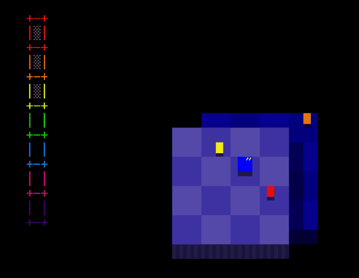
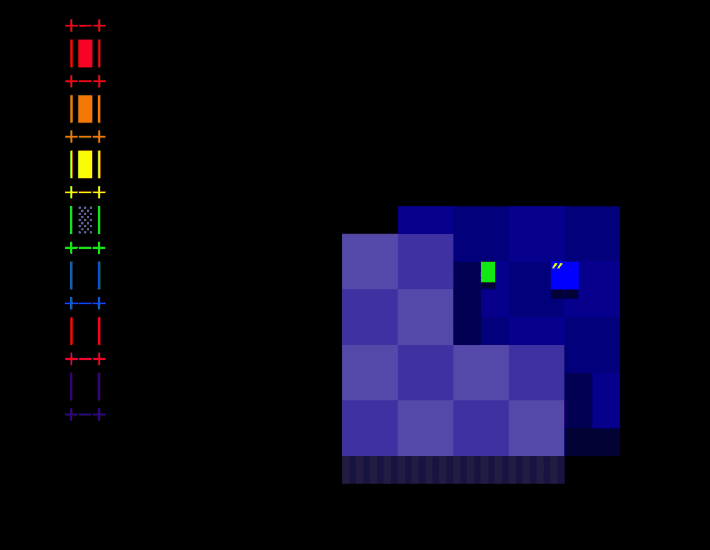
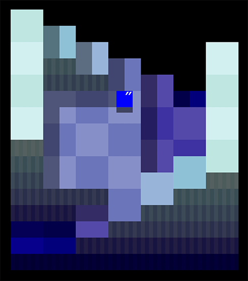
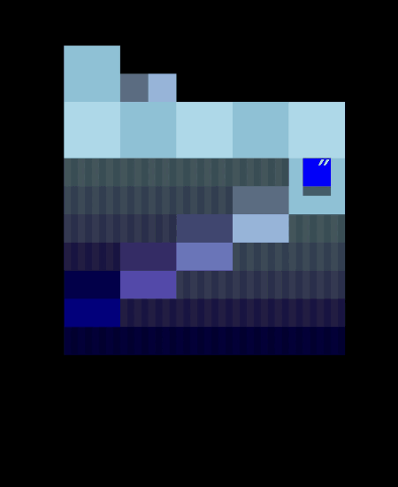
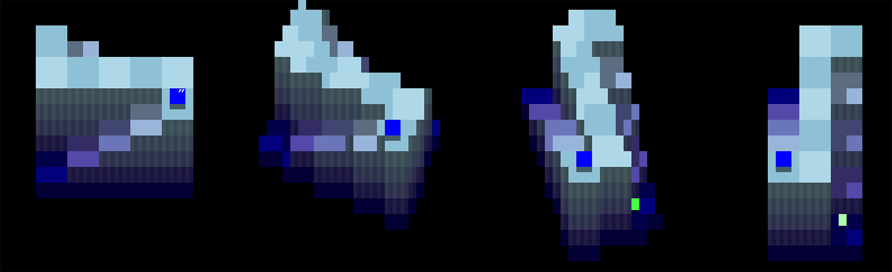
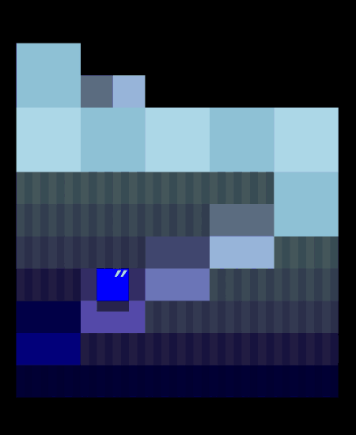
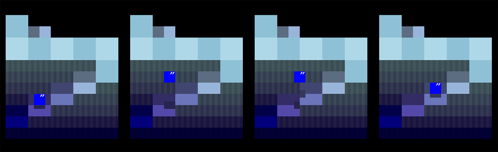
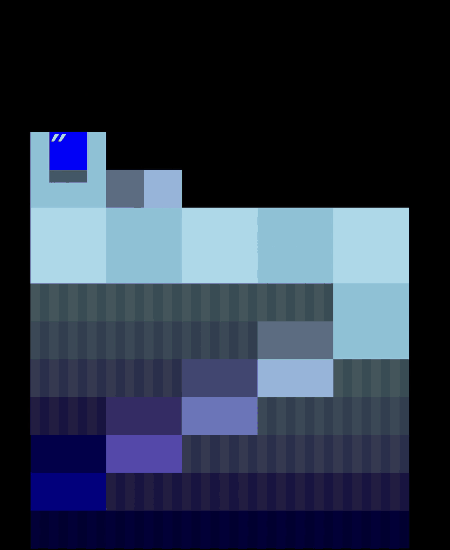
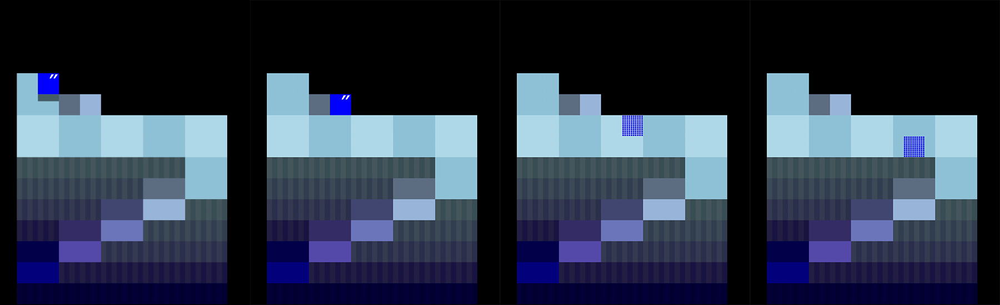

# MELT ーー 溶けていく世界で宝物を集めよう！
進級制作展（HAL EVENT WEEK）に向けて開発した3Dパズルゲーム  

* 個人制作
* プログラミング言語：C言語
* プラットフォーム：80×25文字のWindowsコンソール
* 制作時間：約2ヶ月
* 1年次銀賞受賞

## プレイ動画
https://github.com/user-attachments/assets/dbb3460a-dd85-4214-8aa8-d529e9f6bf75

## 特徴

### アイテム収集
アイテムを全部集めてステージクリア
* ステージの変化と共に、アイテムが現れる
* 「順番で集める」 ・ 「時間制限内に見つける」　をチャレンジ
* だんだん難しくなる３つのステージがある

### 視点回転
回転して固定視点では見えないアイテムを見つける

### 立体感の演出

影 ーー ステージ、プレーヤー、アイテムの影を表示する

シルエット表示 ーー プレーヤーが物陰に隠れた時にシルエットを表示する

## 実装

> 開発当時はコンテスト向けにｃ言語のみを用いて短期間で制作したため、  
> コードに整理が行き届いていない部分が多く、  現在は改善に取り組んでおります。

マップ表示に関連するファイル

* world.h ---- マップのデータを配列に保存する 

  移動や当たり判定は3Dのワールド座標上で計算され、表示方法と独立している

* world_view.h ---- マップの描画

  * world_view_top.h ---- 正面視点の描画、計算が簡単
  * world_view_raycast.h ---- 回転視点（マップ回転中）の描画、レイキャスティングで描画

* cube.h ---- ブロックの色や柄の定義

  * cube_top.h ---- 正面視点の一個のブロックを描画

## 使用した素材

### 効果音
* 魔王魂
* FC音工場
### BGM
* incompetech.com

> Galactic Rap, Mesmerizing Galaxy  
> Kevin MacLeod (incompetech.com)  
> Licensed under Creative Commons: By Attribution 4.0  
> https://creativecommons.org/licenses/by/4.0/  
